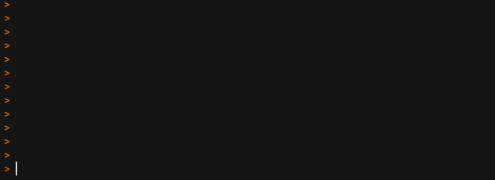
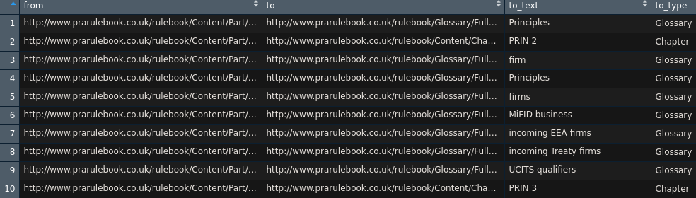

# PRArulebook

<!-- badges: start -->

[](https://www.tidyverse.org/lifecycle/#maturing)
[](https://cran.r-project.org/package=PRArulebook)
<!-- badges: end -->

The goal of `PRArulebook` is to scrape the Prudential Regulation
Authority [Rulebook](http://www.prarulebook.co.uk/) to obtain its text
and structure.

This package was developed while preparing the following Staff Working
Paper:

Amadxarif, Z., Brookes, J., Garbarino, N., Patel, R., Walczak, E. (2019)
*Textual Complexity in Prudential Regulation*. Bank of England Staff
Working Paper No. xxx.

## Installation

You can install the development version of `PRArulebook` from
[GitHub](https://github.com/) with:

``` r
# install.packages("devtools")
devtools::install_github("erzk/PRArulebook")
```

## Examples

Load the package

``` r
library(PRArulebook)
```

### Structure

The simplest way to extract a rulebook structure is to use
`get_structure` function

``` r
# get the structure of the rulebook down to the part-level
parts <-
  get_structure("16-11-2007",
                layer = "part")
# or rule-level (without rule-level URLs)
rules <-
  get_structure("18-06-2019",
                layer = "rule")
```

This will start scraping the PRA rulebook. Pulling data will take longer
if you decide to pull more granular data. The rulebook has several
layers and each of them can be passed to the `layer` argument of
`get_structure` (in descending order):

  - `sector`
  - `part`
  - `chapter`
  - `rule`



This will produce a data frame with the

``` r
library(dplyr)

glimpse(head(rules))
#> Observations: 6
#> Variables: 12
#> $ rule_url        <chr> "http://www.prarulebook.co.uk/rulebook/Content/R…
#> $ rule_id         <chr> "216147", "216148", "216149", "216150", "216151"…
#> $ rule_number_sel <chr> "#216147+ .div-row .rule-number", "#216148+ .div…
#> $ rule_text_sel   <chr> "#216147+ .div-row .col3", "#216148+ .div-row .c…
#> $ rule_link_sel   <chr> "#216147+ .div-row a", "#216148+ .div-row a", "#…
#> $ chapter_url     <chr> "http://www.prarulebook.co.uk/rulebook/Content/C…
#> $ chapter_name    <chr> "PRIN 1 Introduction", "PRIN 1 Introduction", "P…
#> $ part_url        <chr> "http://www.prarulebook.co.uk/rulebook/Content/P…
#> $ part_name       <chr> "PRIN Principles for Businesses", "PRIN Principl…
#> $ sector_url      <chr> "http://www.prarulebook.co.uk/rulebook/Content/S…
#> $ sector_name     <chr> "High Level Standards", "High Level Standards", …
#> $ rulebook_url    <chr> "http://www.prarulebook.co.uk/rulebook/Home/Hand…
```

### Content

#### Text

To get content of the rulebook (text or links) use `get_content`
function a URL of a given chapter/part/sector. This function can be
applied on the entire rulebook in the following way

``` r
# scrape text
parts_text <-
  purrr::map_df(parts$part_url,
                get_content)
```

There is another, even faster way, to acquire this data by scraping the
website in parallel using
[furrr](https://cran.r-project.org/web/packages/furrr/). In this example
it took 153 sec to run the scraper in parallel vs. 249 sec using
`purrr`.

``` r
library(furrr)
library(future)

plan(multiprocess)

parts_text <-
  furrr::future_map_dfr(parts$part_url,
                        get_content,
                        .progress = TRUE)
```

#### Network

To scrape the links and create data set for network analysis
`get_content` function can be used but with a `type` argument set to
`"link"`. Like in the previous example, this call can also be
parallelised.

``` r
# sequential
parts_links <-
  purrr::map_df(parts$part_url,
                get_content,
                "links")

# parallel (faster)
future::plan(multiprocess)

parts_links <-
  furrr::future_map_dfr(parts$part_url,
                        get_content,
                        "links",
                        .progress = TRUE)
```

The code above will return a data frame with *from/to url*, *text* used
in a link, and a *type* of a link.

This
[page](http://www.prarulebook.co.uk/rulebook/Content/Part/216145/16-11-2007)
with extracted links (edges) will return the following



Scraped data containing information about the links can be used for
network analysis (warning: further cleaning is required).

### Rule-level data

Things get a bit more complicated when you need **rules and their
corresponding URLs**. This requires digging through the code on the
chapter-level and then visiting each rule separately so it is **much
slower** than the previous method.

The first command extracts the structure on the chapter-level. The
second command extracts rule-IDs.

``` r
chapters_df <-
  get_structure("16-11-2007",
                layer = "chapter")

rules_df <-
  scrape_rule_structure(chapters_df,
                        date = "16-11-2007")
```

This will generate a data frame with rule-level structure.

### Disclaimer

This is an outcome of a research project and is not an official Bank of
England software. All errors are mine. The software and code samples are
provided “as is” without warranty of any kind, either express or
implied. Use at your own risk.
